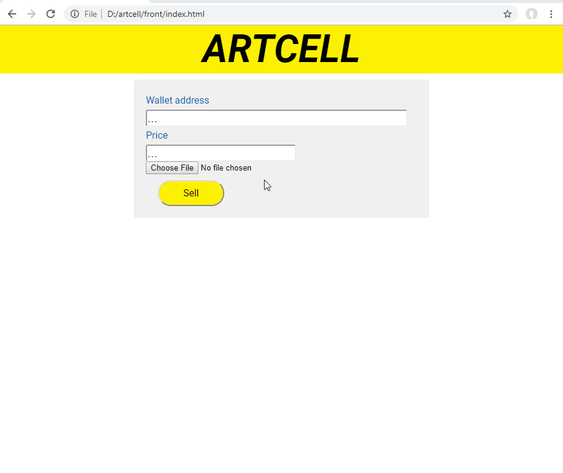

# Advertise, own, store and sell digital content on distributed network with one button click

[ARTCELL pitch on Russian at 2019-03-24](https://www.youtube.com/watch?v=zrini-SSjB8)

- We want to give people future of the internet.
- Create serverless branded site. Use dozen of available options on market
- Attach distributed identity to it.
- Drag Artcell web element into site
- User authenticates via distributed identity
- Upload via Artcell into distributed file storage
- Allow to transfer some rights of file from that page for currency
- Allow to pay via currency and transfer rights via created static page
- Attache static search to static page
- Attach semantic markup to allow search page as via Search engines as World Wide Shop
- Avoid non original works via near match search in p2p networks.

